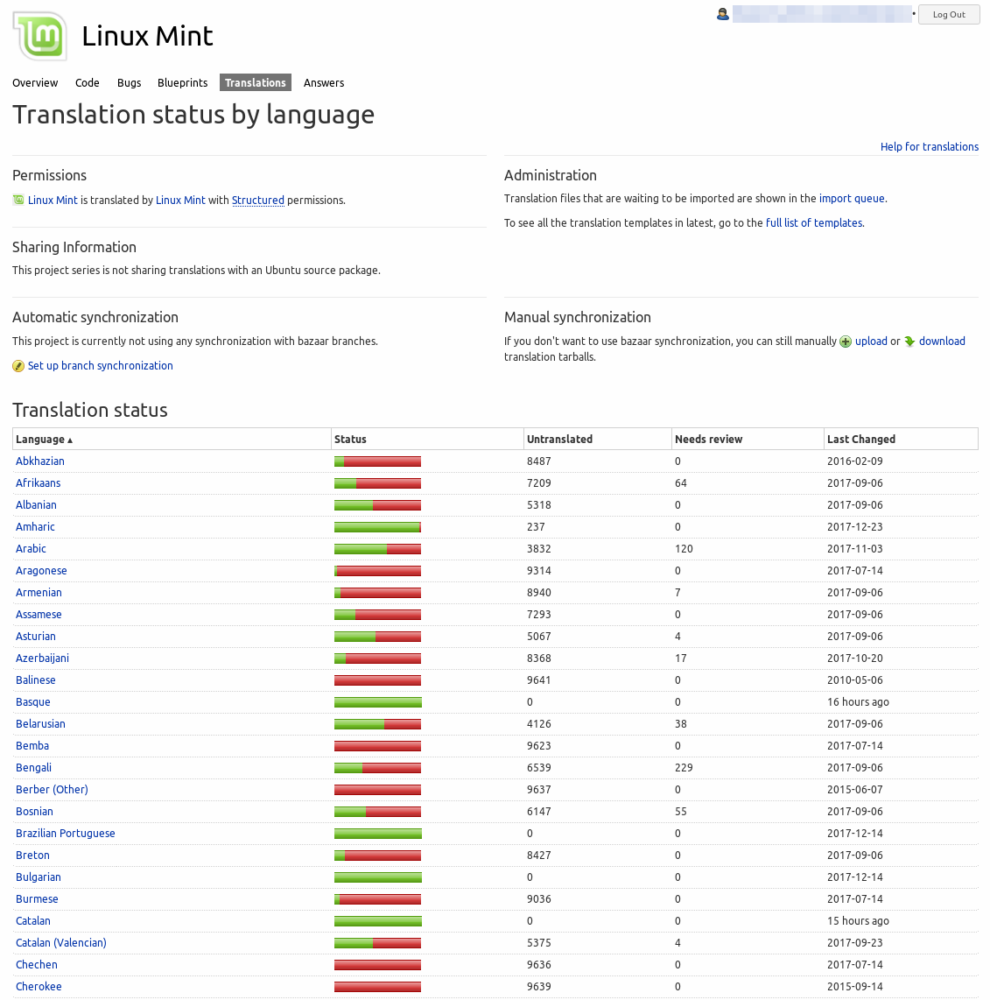
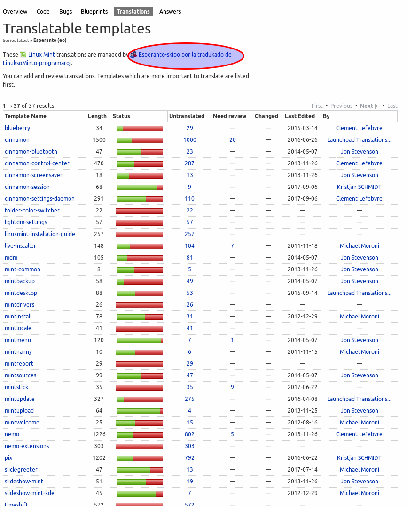
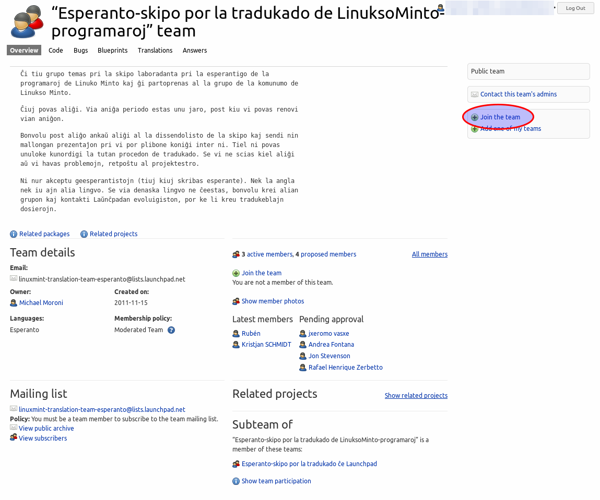
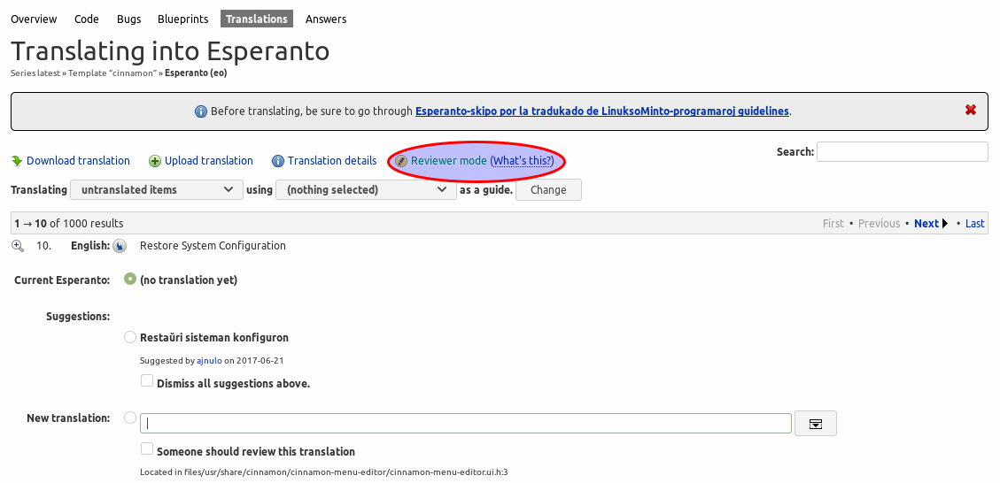
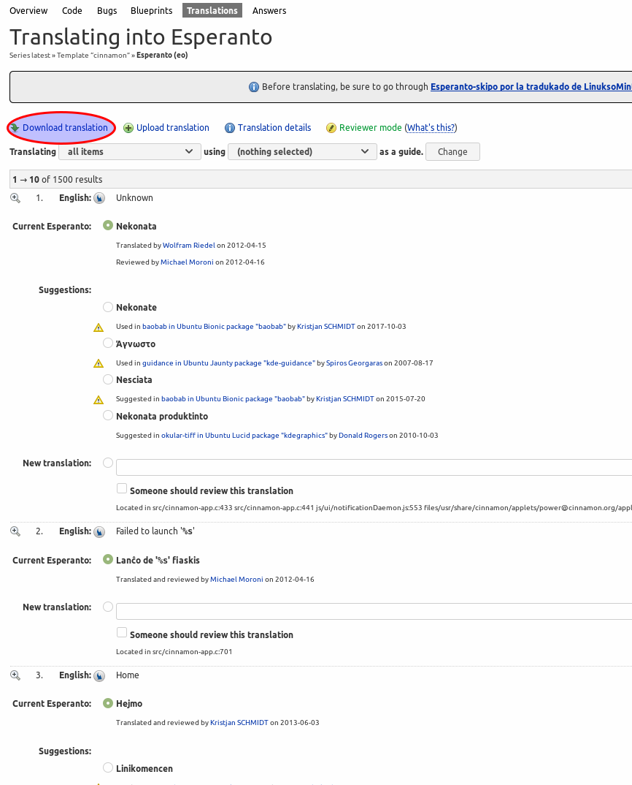
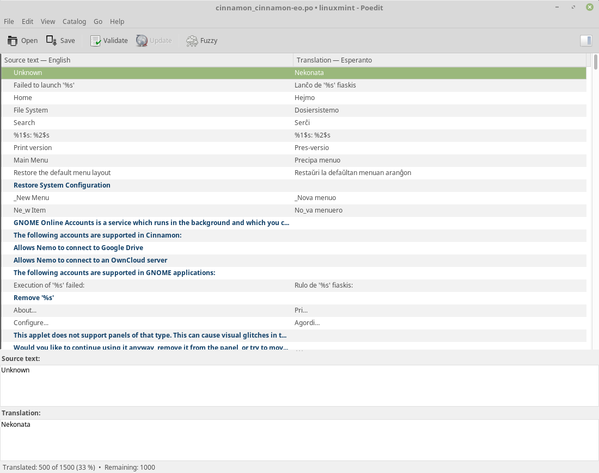
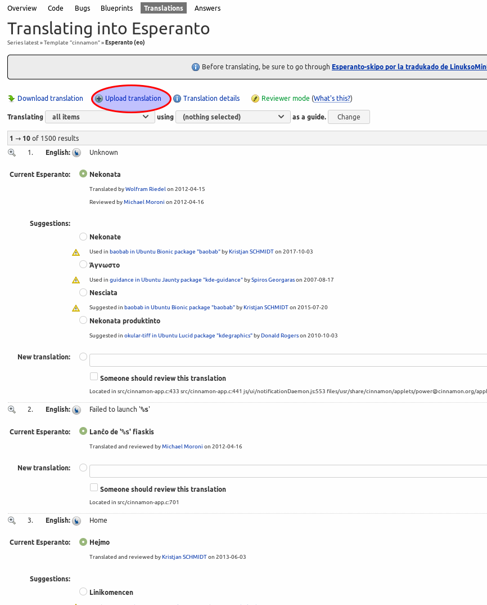

Launchpad ব্যবহার করে
====================

Launchpad অ্যাকাউন্ট তৈরি করুন
-----------------------------

যদি আপনার আগে থেকেই একটি Launchpad অ্যাকাউন্ট না থাকে, তাহলে `রেজিস্ট্রেশন পৃষ্ঠা <https://login.launchpad.net/+login>`_ ব্যবহার করে একটি নতুন অ্যাকাউন্ট তৈরি করুন।

আপনার অ্যাকাউন্টের জন্য ভাষাগুলি এডিট করুন এবং আপনি যেসব ভাষায় সাবলীল, সেগুলি যোগ করুন।

আপনার ভাষার জন্য অনুবাদ দল যোগ করুন
--------------------------------

সব ভাষা এবং তাদের বর্তমান স্থিতি দেখতে, `ভাষা অনুযায়ী অনুবাদ স্থিতি <https://translations.launchpad.net/linuxmint/latest/>`_-এ যান এবং :guilabel:`View all languages` ক্লিক করুন।

আপনার ভাষায় ক্লিক করুন এবং তারপর সেই দলের নামের ওপর ক্লিক করুন, যারা আপনার ভাষায় অনুবাদগুলোর জন্য দায়ী:

: gualabel:`Join the team` ক্লিক করুন:

Launchpad ব্যবহার করে অনুবাদ করুন
------------------------------

একবার আপনি অনুবাদ দলের সদস্য হলে, আপনি অনুবাদ শুরু করতে পারবেন।

আপনার ভাষায় ক্লিক করুন, একটি প্রকল্প বাছুন যেটিতে অনুবাদ অসম্পূর্ণ রয়েছে এবং অনুবাদহীন আইটেমগুলোর সংখ্যায় ক্লিক করুন।

পৃষ্ঠার উপরে, নিশ্চিত করুন যে আপনি ``Reviewer mode``-এ আছেন (অন্যথায় আপনার অনুবাদগুলো স্বয়ংক্রিয়ভাবে অনুমোদিত হবে না এবং অন্য কেউ সেগুলো পর্যালোচনা করার জন্য অপেক্ষা করবে)।

POEdit ব্যবহার করে
================

যদি আপনি দ্রুত অনুবাদ করতে চান, তাহলে আপনি অনুবাদগুলি ``.po`` ফাইল হিসেবে ডাউনলোড করতে পারেন, সেই ফাইলটি একটি টুল ব্যবহার করে যেটিকে ``poedit`` বলা হয় এডিট করুন এবং সম্পাদিত ``.po`` ফাইলটি আবার Launchpad-এ আপলোড করুন।

.. _download-ref:

অনুবাদ ডাউনলোড করুন
-------------------

একটি প্রকল্প বাছুন এবং :guilabel:`Download translation` ক্লিক করুন:

ফাইল ফরম্যাট হিসেবে ``PO format`` নির্বাচন করুন এবং :guilabel:`Request Download` ক্লিক করুন।

Launchpad আপনাকে একটি ইমেইল পাঠাবে (এটি কিছুটা সময় নিতে পারে)। ইমেইলে আপনি একটি ডাউনলোড লিঙ্ক পাবেন যা সরাসরি ``.po`` ফাইল অথবা একটি কম্প্রেসড আর্কাইভ containing the ``.po`` ফাইলের লিঙ্ক হতে পারে।

POEdit ব্যবহার করুন
------------------

POEdit ইনস্টল করতে, একটি টার্মিনাল খুলুন এবং টাইপ করুন:

.. code-block:: console

    apt install poedit

Launchpad থেকে পাওয়া ``.po`` ফাইলটি POEdit দিয়ে খুলুন:

মেনুগুলি ব্রাউজ করুন এবং কীবোর্ড শর্টকাটগুলি জানুন। আপনি যদি এই শর্টকাটগুলি এবং অন্তর্নির্মিত বানান চেকার ব্যবহার করেন, তাহলে POEdit দিয়ে আপনি Launchpad-এর তুলনায় অনেক দ্রুত অনুবাদ করতে পারবেন।

সম্পন্ন হলে, :guilabel:`Save` ক্লিক করুন।

অনুবাদগুলি আবার Launchpad-এ আপলোড করুন
---------------------------------------

Launchpad-এ, :guilabel:`Upload translation` ক্লিক করুন।

আপনার ``.po`` ফাইলটি নির্বাচন করুন এবং :guilabel:`Upload` ক্লিক করুন।

``Translation Import Queue`` ক্লিক করুন এবং দেখুন `সর্বশেষ অনুবাদ ইমপোর্ট কিউ <https://translations.launchpad.net/linuxmint/latest/+imports>`_। যদি আপনার আপলোডটি ``Needs Review`` হিসাবে চিহ্নিত হয়, তবে ``Edit`` বোতামটি (যেটি কলমের চিহ্ন দ্বারা চিহ্নিত) ক্লিক করুন, সঠিক টেমপ্লেট (যেমন প্রকল্প) নির্বাচন করুন এবং ``Approve`` ক্লিক করুন।
