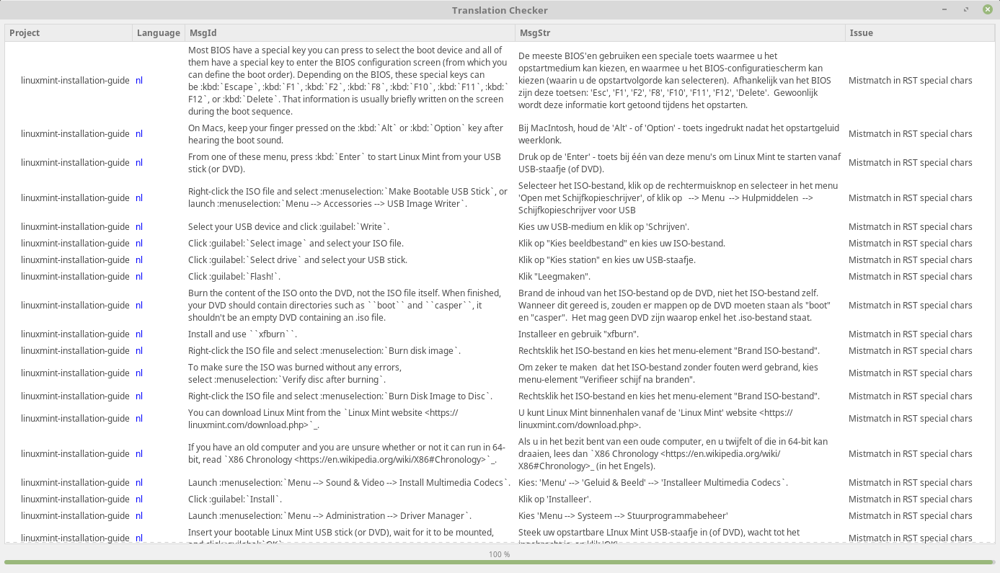

আপনার অনুবাদ যাচাই করুন
====================

আপনার PO ফাইল ডাউনলোড করুন
--------------------------

যদি আপনার অনুবাদগুলি Launchpad-এ থাকে, তাহলে সেগুলি ``.po`` ফাইল হিসেবে ডাউনলোড করুন, যেমন :ref:`download-ref`-এ ব্যাখ্যা করা হয়েছে।

আপনার হোম ডিরেক্টরিতে একটি ``translations`` ডিরেক্টরি তৈরি করুন এবং সেখানে আপনার PO ফাইলটি রাখুন।

mint-dev-tools ইনস্টল করুন
-------------------------

আপনার অনুবাদ যাচাই করতে, আপনাকে ``mint-check-translations`` নামক একটি টুল প্রয়োজন, যা ``mint-dev-tools`` এর অংশ।

একটি টার্মিনাল খুলুন এবং টাইপ করুন:

.. code-block:: console

    apt install mint-dev-tools

mint-check-translations দিয়ে আপনার PO ফাইল যাচাই করুন
-----------------------------------------------------

আপনার অনুবাদগুলো চেক করতে, একটি টার্মিনাল খুলুন এবং টাইপ করুন:

.. code-block:: console

    mint-check-translations ~/translations

এটি অনুবাদ যাচাই করার টুল খুলবে এবং আপনার PO ফাইলে ত্রুটিগুলি হাইলাইট করবে:



এই টুলটি আপনার অনুবাদে থাকা ভুলগুলিকে (ব্যাকরণ, বানান ইত্যাদি) হাইলাইট করবে না, তবে এটি নিশ্চিত করবে যে আপনার অনুবাদ সঠিকভাবে গঠন করা হয়েছে এবং আপনার অনুবাদ করা সফটওয়্যারের ওপর কোনো প্রভাব ফেলবে না। এর মধ্যে অন্যান্য বিষয়গুলোর মধ্যে এই টুলটি পরীক্ষা করে যে বিশেষ অর্থবহ অক্ষরগুলি সঠিকভাবে সংরক্ষিত হয়েছে, ভেরিয়েবলগুলি ঠিক আছে, ইত্যাদি।

.. note::
    এই টুলটি একাধিক PO ফাইল স্ক্যান করতে পারে এবং সাবডিরেক্টরিগুলোর মধ্যেও রিকার্সিভভাবে যাচাই করতে পারে। এটি লিনাক্স মিন্ট টিম দ্বারা সমস্ত অনুবাদ যাচাই করার জন্য ব্যবহৃত হয়।

সাধারণ ভুল
==========

সফটওয়্যার অ্যাপ্লিকেশনগুলিতে
-------------------------

সোর্স কোড অনুবাদ করার সবচেয়ে সাধারণ ভুল হলো ভেরিয়েবলগুলিকে সঠিকভাবে সম্মান না করা।

এখানে কিছু ভুল অনুবাদের উদাহরণ দেওয়া হলো:

+-----------------------------------------+----------------------------------------------+-----------------------------------+
| মূল                                       | অনুবাদ                                      | ভুল                               |
+=========================================+==============================================+===================================+
| The file %s could not be found          | Le fichier % s est introuvable               | % s এর পরিবর্তে %s               |
+-----------------------------------------+----------------------------------------------+-----------------------------------+
| The file %s could not be found          | Le fichier %d est introuvable                | %d এর পরিবর্তে %s                |
+-----------------------------------------+----------------------------------------------+-----------------------------------+
| The file %s could not be found          | Le fichier est introuvable                   | ভেরিয়েবল অনুপস্থিত              |
+-----------------------------------------+----------------------------------------------+-----------------------------------+
| The file %(file)s could not be found    | Le fichier %(fichier)s est introuvable       | ভেরিয়েবল %(file)s অনুপস্থিত    |
+-----------------------------------------+----------------------------------------------+-----------------------------------+

যদি ভেরিয়েবলগুলি ভুলভাবে গঠিত হয়, অনুপস্থিত থাকে, অথবা তাদের নাম মূল সোর্স কোডের সাথে মেলে না, তাহলে আপনি যে অ্যাপ্লিকেশনটির অনুবাদ করছেন তা আপনার ভাষায় চালানোর সময় ক্র্যাশ করতে পারে।

RST-এ লেখা ডকুমেন্টেশনে
-------------------------

RST ডকুমেন্টেশন অনুবাদ করার সবচেয়ে সাধারণ ভুল হলো ডাবল কোটেশন, তীরচিহ্ন বা RST নির্দেশনাগুলি সঠিকভাবে সম্মান না করা।

এখানে কিছু ভুল অনুবাদের উদাহরণ দেওয়া হলো:

+-----------------------------------------+----------------------------------------------+-----------------------------------+
| মূল                                       | অনুবাদ                                      | ভুল                               |
+=========================================+==============================================+===================================+
| Open a terminal and type \`\`ls\`\`     | Ouvrez un terminal et tapez "ls"             | " এর পরিবর্তে \`\`              |
+-----------------------------------------+----------------------------------------------+-----------------------------------+
| Click \:guilabel:\`Save\`               | Cliquez sur \:guilabel:\'Save\'              | ' এর পরিবর্তে \`                |
+-----------------------------------------+----------------------------------------------+-----------------------------------+
| Click \:guilabel:\`Save\`               | Cliquez sur \:guilabel:\`Save                | এক \` অনুপস্থিত                |
+-----------------------------------------+----------------------------------------------+-----------------------------------+
| Click \:guilabel:\`Save\`               | Cliquez sur guilabel:\`Save\`                | এক \: অনুপস্থিত                |
+-----------------------------------------+----------------------------------------------+-----------------------------------+
| Click \:menuselection:\`Menu --> Save\` | Cliquez sur \:menuselection:\`Menu -> Save\` | \-> এর পরিবর্তে \-->            |
+-----------------------------------------+----------------------------------------------+-----------------------------------+

বিশেষ চরিত্র যেমন `````, ``-->``, নির্দেশনা যেমন ``:guilabel:``, ``:menuselection::``, এবং ``<`` এবং ``>`` ব্যবহার করা লিঙ্কগুলি গুরুত্বপূর্ণ, কারণ এগুলি ডকুমেন্টের গঠন এবং চেহারা নির্ধারণ করে।

এগুলি সম্মান করুন এবং সঠিকভাবে অনুবাদ করুন।

যদি আপনি মনে করেন যে মূল বাক্যটি কিছু বাদ দিয়েছে, তবে মূল ডকুমেন্টেশনে একটি সংশোধন প্রস্তাব করুন। আপনি আপনার অনুবাদে কোনো কিছু অতিরিক্ত যোগ করতে পারবেন না যা মূল ডকুমেন্টে নেই।

অন্যান্য ভুল
===========

রাজনীতি
--------

অনুবাদ করার সময়, আপনার প্রধান চিন্তা হওয়া উচিত ব্যবহারকারী।

ব্যবহারকারীর অভিজ্ঞতাই সবচেয়ে গুরুত্বপূর্ণ।

সফটওয়্যার এবং ডকুমেন্টেশন সহজে ব্যবহারযোগ্য হওয়া উচিত এবং আপনার অনুবাদ করা যেকোনো টেক্সট সহজে পড়া এবং বোঝা উচিত।

ব্যবহারকারীর অভিজ্ঞতা অন্য যেকোনো বিবেচনার চেয়ে বেশি গুরুত্বপূর্ণ, যার মধ্যে রয়েছে সরকারি ভাষার সংজ্ঞা, ভাষা সংরক্ষণ নীতিমালা অথবা সাধারণ রাজনীতি।

যদি একটি নির্দিষ্ট শব্দের সরকারি অনুবাদটি সাধারণভাবে পরিচিত না হয় বা ব্যবহারকারীদের মধ্যে ব্যবহৃত না হয়, তবে আপনি তা ব্যবহার করবেন না। বরং এমন শব্দ ব্যবহার করুন যা বেশিরভাগ মানুষ ব্যবহার করে। লক্ষ্য হলো ব্যবহারকারীদের শিক্ষা দেওয়া বা কিছু চাপিয়ে দেওয়া নয়। সঠিকতা এবং নির্ভুলতা গুরুত্বপূর্ণ, কিন্তু ব্যবহারকারীর অভিজ্ঞতার চেয়ে তা কম গুরুত্বপূর্ণ।

যদি আপনার চারপাশের সবাই A বলে এবং আপনার সরকার বা অভিধান B বলে, তাহলে আপনি একপক্ষের সাথে একমত হন বা না হন, তা irrelevant; A ব্যবহার করুন।

যে কনটেন্টটি অনুবাদ করা উচিত নয় তা অনুবাদ করা
------------------------------------------

যদি কোনো কিছু স্ক্রীনে ইংরেজিতে থাকে, তবে সেটি ইংরেজিতেই উল্লেখ করুন।

যেমন, লিনাক্স মিন্টের বুট মেনুতে লেখা থাকে ``Start Linux Mint``, তা ব্যবহারকারীর যে ভাষাই হোক না কেন। তাই এটি যেকোনো ডকুমেন্টেশনে ``Start Linux Mint`` হিসেবেই উল্লেখ করা উচিত, সেটা ইংরেজিতে হোক বা অন্য কোনো ভাষায়।
